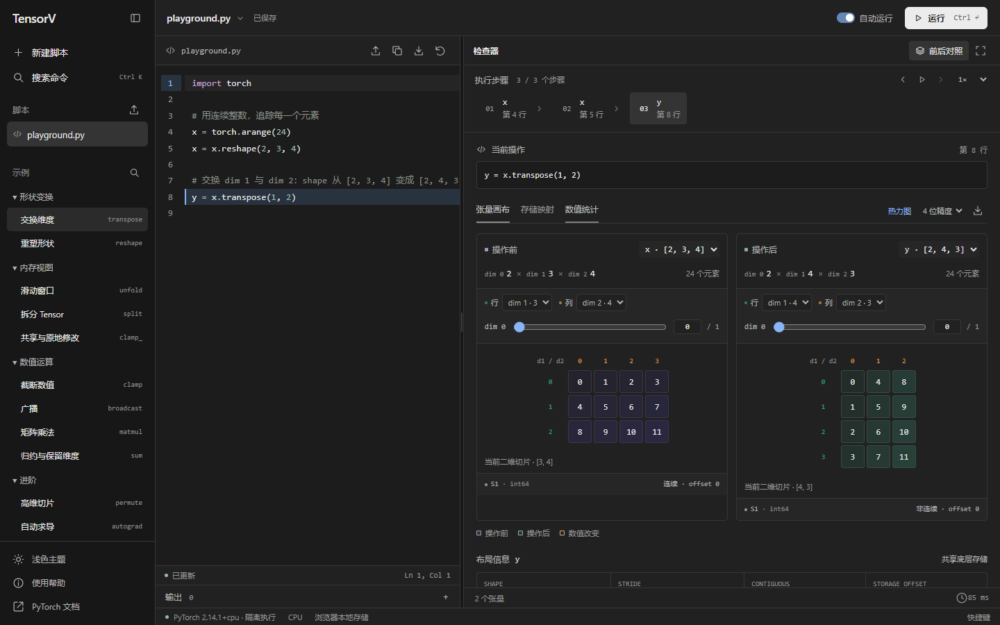

# TensorV

TensorV 是面向 PyTorch 的张量检查工具。它执行 Python 代码，记录语句级张量快照，并在同一工作区中展示数值、形状、步长和底层存储关系。

适用于算子行为验证、张量布局调试和短程序演示。当前执行环境以 CPU 为主；它不提供训练任务管理、分布式计算或通用 Notebook 服务。

## 在线访问

[打开 TensorV 工作区](https://tensorv.43.135.182.151.nip.io)

公共演示实例通过 HTTPS 访问，Python 代码在服务器上的独立 gVisor 沙箱中执行，访问者无需安装环境或保持本地服务运行。当前采用单执行并发，单次执行默认限制为 20 秒、1 核 CPU 和 512 MiB 内存，并设置访问频率和会话限额；繁忙时请稍后重试。

脚本保存在访问者的浏览器中，运行时提交到服务器。不要向公共实例提交密钥或机密数据。需要本机执行或独立资源时，可按下文进行本地部署，或参照[服务器部署](docs/server-deployment.md)自行运行。



## 功能

| 工作区 | 能力 |
| --- | --- |
| 代码编辑 | Python 语法高亮、多脚本管理、自动保存、文件导入导出、手动或自动运行 |
| 执行检查 | 语句级轨迹、前后对照、步骤回放、异常位置及标准输出 |
| 张量浏览 | 高维切片、二维分页、数值精度设置、热力图、坐标锁定 |
| 存储分析 | shape、dtype、stride、storage offset、连续性和共享存储关联 |
| 数据分析 | 快照统计、当前切片分布、CSV / JSON 导出 |
| 示例库 | 13 个可编辑示例，覆盖形状变换、广播、归约、矩阵乘法、内存视图与自动求导 |

## 本地运行

需要 Git、Python 3.10 或更高版本，以及 Node.js 20.19+ 或 22.12+。Python 版本和平台须有可安装的 PyTorch 发行包。首次安装需要网络访问。

**Windows PowerShell**

```powershell
git clone https://github.com/Livia-Tassel/TensorV.git
cd TensorV
.\start.ps1
```

**macOS / Linux**

```sh
git clone https://github.com/Livia-Tassel/TensorV.git
cd TensorV
sh start.sh
```

访问 [http://127.0.0.1:8765](http://127.0.0.1:8765)。启动脚本创建虚拟环境、补齐缺失依赖、构建前端并启动 Python 服务；按 `Ctrl+C` 停止。

使用期间需要保持 **Python 服务运行**。前端构建完成后由 Python 提供静态文件，日常运行不需要启动 Vite，也不需要常驻 Node.js 进程。关闭服务后，浏览器不能执行代码或请求新的切片。

本地模式运行当前用户信任的 Python 代码，拥有该用户的文件和网络权限。不要将本地模式通过端口转发或反向代理公开。面向其他用户的部署请使用独立的公共执行模式，参见[服务器部署](docs/server-deployment.md)。

安装过程、手动启动、更新和故障排查见[本地部署](docs/local-deployment.md)。

## 使用

1. 新建脚本，或从侧栏选择示例、导入 `.py` 文件。
2. 点击“运行”，或使用 `Ctrl / ⌘ + Enter`。自动运行可在顶部开关中控制。
3. 在执行步骤中选择语句，再选择需要检查的 Tensor。
4. 在张量画布中调整维度和索引；切换到存储映射或数值统计继续分析。
5. 下载代码，或将当前切片导出为 CSV / JSON。

脚本保存在当前浏览器的本地存储中，不会在不同设备间自动同步。清除站点数据会删除这些脚本；需保留的代码应下载为文件。运行时，代码会发送到当前连接的执行服务。

操作说明和数据语义见[用户指南](docs/user-guide.md)。

## 部署与运行边界

TensorV 包含浏览器前端和 Python 执行服务，不能仅通过静态网页托管提供完整功能。本地运行服务位于用户计算机；服务器部署后，服务由服务器持续运行，访问者只需浏览器。

本地模式每个 Tensor 最多保留 100,000 个元素，单次执行的历史数值预算为 64 MiB，最多记录 128 步、每步 32 个 Tensor。公共模式采用更严格的资源和快照限制。界面每页最多展示 24 × 24 个元素。详见[架构与执行模型](docs/architecture.md)。

## 文档

| 文档 | 内容 |
| --- | --- |
| [本地部署](docs/local-deployment.md) | 环境准备、启动、更新、卸载与常见问题 |
| [用户指南](docs/user-guide.md) | 脚本管理、执行检查、切片、统计及导出 |
| [服务器部署](docs/server-deployment.md) | 公共服务的执行隔离、安装与入口配置 |
| [运行维护](docs/operations.md) | 健康检查、日志、更新、故障处理与恢复 |
| [架构与执行模型](docs/architecture.md) | 组件、数据流、接口与能力边界 |
| [开发指南](CONTRIBUTING.md) | 开发环境、验证和变更提交 |
| [安全说明](SECURITY.md) | 信任边界、公开部署要求与问题报告 |
