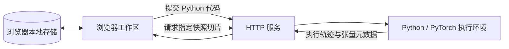

# 架构与执行模型

## 组件

TensorV 由浏览器工作区、HTTP 服务和 Python 执行引擎组成。浏览器负责编辑、布局、交互和数据展示；PyTorch 的计算与快照采集在执行端完成，前端不模拟算子。

`npm run build` 将前端打包至 `dist/`。服务运行时读取该目录提供静态页面，因此部署后的前端不依赖 Vite 常驻，也不需要 Node.js 运行时来处理访问请求。

浏览器 localStorage 保存脚本与界面偏好。Python 变量、执行轨迹和张量快照属于执行端的临时状态，不与脚本一起持久化。

## 执行流程

1. 浏览器向执行接口提交完整代码。
2. 引擎解析 Python AST，并在顶层语句前后插入记录逻辑。
3. 在新的变量命名空间中执行代码，收集标准输出、异常和张量状态。
4. 为可展示 Tensor 保存独立数值快照，返回元数据及默认二维切片。
5. 浏览器根据步骤、变量、维度及页码请求后续切片。

执行前会重置 PyTorch 随机种子。函数体、循环和复合语句按 Python 语义执行，快照只在顶层语句边界采集，不提供逐行调试、断点、栈检查或循环迭代回放。

每次执行替换该执行上下文的历史快照。快照 ID 仅在对应执行状态仍存在时有效；客户端收到过期错误后需要重新运行代码。

## 快照与存储语义

快照记录以下信息：

| 类别 | 字段或含义 |
| --- | --- |
| 身份 | 快照 ID、变量路径、执行步骤 |
| 形状 | shape、维度数量、元素数量 |
| 类型 | dtype、原始 device、单元素大小 |
| 布局 | stride、storage offset、连续性 |
| 存储关系 | 本次运行内的底层存储编号 |
| 数据 | CPU 上的独立数值副本、默认切片、可用性和限制说明 |
| 统计 | 有限实数数量、非有限数值数量、最小值、最大值、均值、总体标准差 |

引擎保留原始存储句柄以避免分配地址重用导致错误关联，并对数值进行独立复制。因此后续原地写入不会改变历史结果；存储编号仍可表达原始 Tensor 之间的视图与复制关系。

存储偏移以元素为单位，不是字节地址。不同 dtype 的视图不做跨类型元素联动。`numel × element_size` 是逻辑数据大小，不能据此计算某次算子实际新增分配的内存。

数值统计使用完整快照；分布图使用浏览器当前切片。超出 JavaScript 安全整数范围的整数、非有限浮点数和复数通过字符串传输，避免 JSON 解析破坏表示。大整数统计使用 float64，存在近似误差。

## 容量与执行边界

| 项目 | 本地模式 | 公共模式 |
| --- | --- | --- |
| 提交代码长度 | 20,000 字符 | 20,000 字符 |
| 单个 Tensor 数值快照 | 100,000 个元素 | 100,000 个元素 |
| 单次执行历史数值预算 | 64 MiB | 2 MiB，且合计最多 100,000 个历史元素 |
| 单次执行记录 | 128 步 | 64 步 |
| 每步采集 Tensor | 32 个 | 16 个 |
| 容器嵌套展开 | 最多向下展开 3 层 | 最多向下展开 3 层 |
| 单页切片 | 24 × 24 个元素 | 24 × 24 个元素 |
| 引擎捕获输出 | 32,000 字符 | 32,000 字符 |
| 默认执行超时 | 8 秒；首次 PyTorch 初始化另有等待时间 | 20 秒，包含 PyTorch 冷启动；容器创建和清理另有限时 |

快照预算约束保存的历史数值，不限制用户代码自身申请的内存。普通稠密 Tensor 支持数值快照；稀疏和 meta Tensor 只保留可用元数据。超过数值大小或预算时仍返回元数据，超过步骤限制会终止该次记录并返回错误。

## 执行模式

本地模式通过 `python -m tensorv.server` 启动，默认监听回环地址。HTTP 服务与可重启工作进程分离，用于处理超时和故障恢复。工作进程继承当前用户的系统权限，不能作为不可信代码的安全边界。

公共模式通过 `python -m tensorv.public_server` 启动，只允许绑定回环地址，由反向代理提供公网入口。每次运行新建 gVisor 容器，执行完成或超时后销毁；后续切片查询使用公共网关内存中已校验的数值数据，不复用用户代码进程。宿主机网关不导入 PyTorch，也不将用户代码作为 Python 执行。

公共网关以匿名会话隔离快照，检查 Host 和 Origin，并限制执行频率、活跃会话、并发及连接数。隔离运行时未通过启动检查时，服务拒绝启动，不回退到本地执行。配置见[服务器部署](server-deployment.md)，威胁边界见[安全说明](../SECURITY.md)。

公共网关把隔离进程返回的数据当作不可信输入，只接受受限 JSON 结构，重新校验形状、数值数量和字段类型后再缓存。它不会从执行环境反序列化 Python 对象。此验证约束数据结构和资源占用，不能证明恶意代码自行构造的数值具有真实性。

## HTTP 接口

以下接口用于当前前端与服务之间的通信，尚未承诺为独立、版本化的第三方 API。

| 方法 | 路径 | 用途 |
| --- | --- | --- |
| `GET` | `/api/health` | 服务状态及执行环境信息 |
| `POST` | `/api/execute` | 提交 JSON 对象中的 `code`，返回执行轨迹、输出和错误 |
| `POST` | `/api/slice` | 根据快照 ID、行列维度、固定索引和页码查询切片 |

写入接口使用 `application/json`，并检查来源和请求大小。本地入口只接受本机 Host 和同源请求。公共入口还需要自身的会话与访问控制；健康检查成功不代表实际执行链路已通过验证。

返回 [README](../README.md) · [开发指南](../CONTRIBUTING.md)
